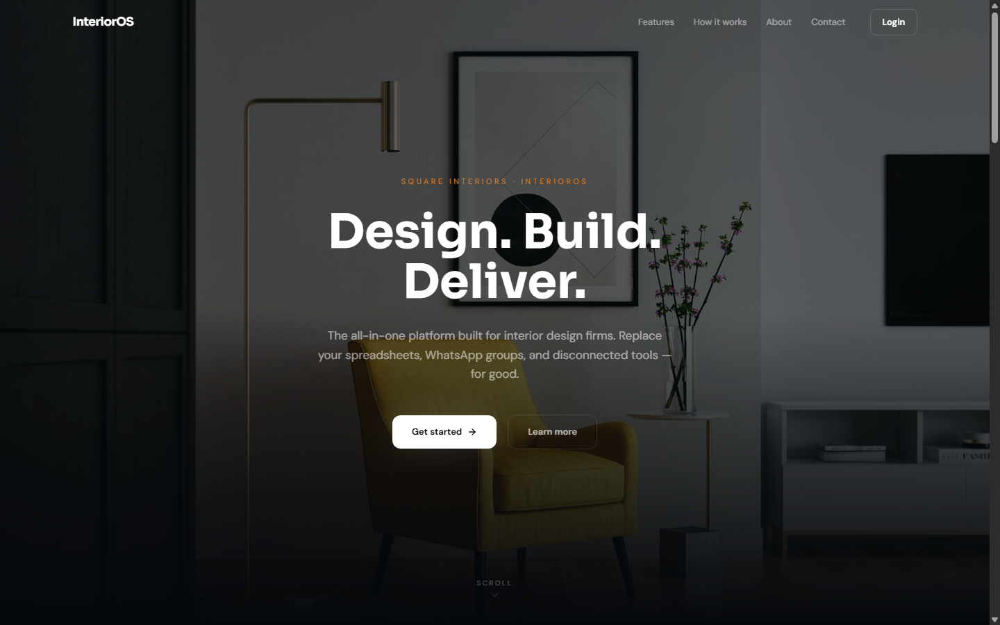
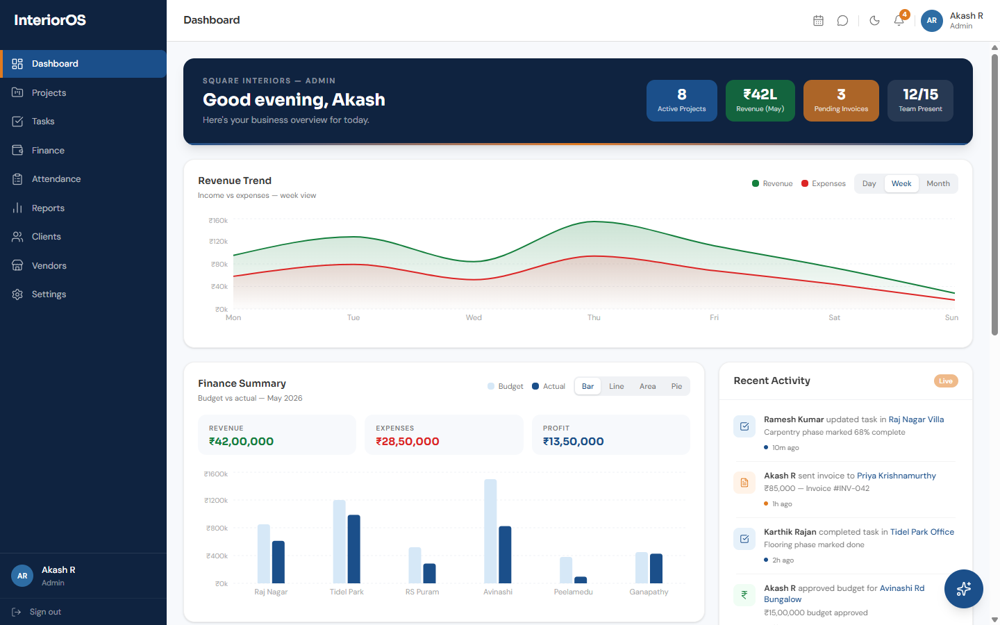
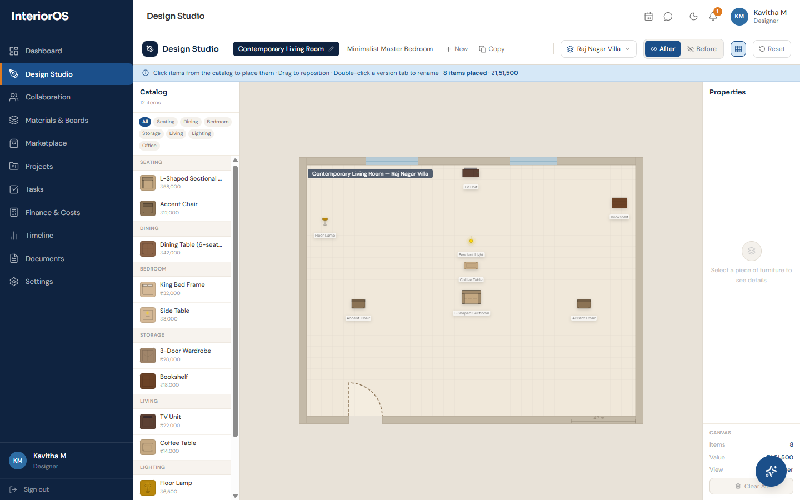
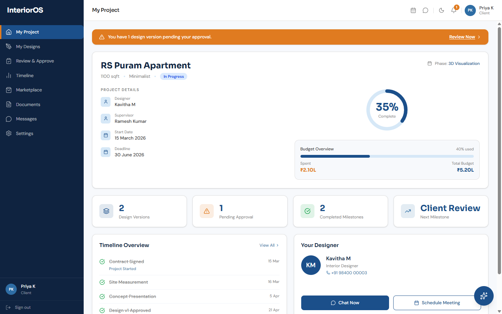
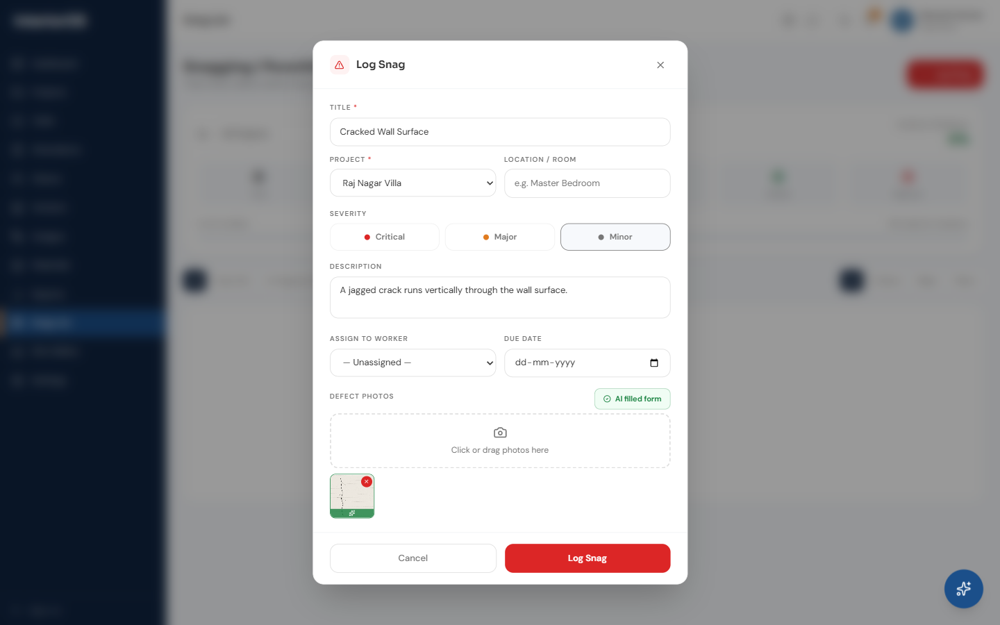
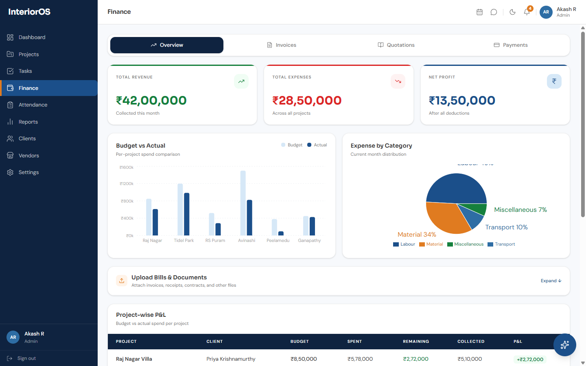
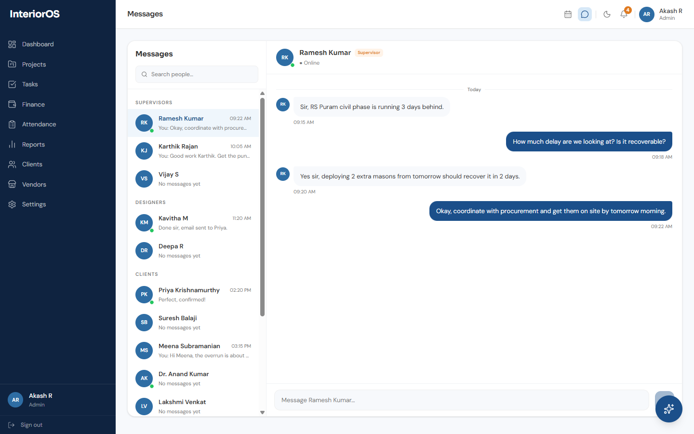
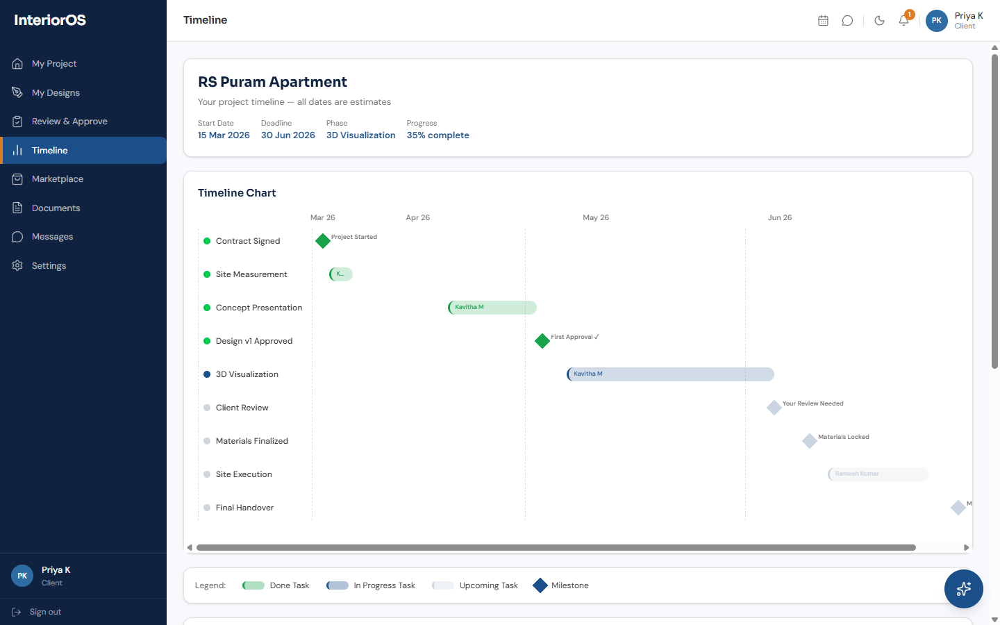

# InteriorOSS

<p align="center">
  <h3 align="center">AI-Powered Interior Design & Construction Management Platform</h3>
</p>

<p align="center">
InteriorOSS is a modern full-stack platform built to simplify project management, client collaboration, financial tracking, workforce coordination, and AI-assisted construction quality inspections for interior design and construction teams.
</p>

---

## Overview

InteriorOSS brings every stage of an interior construction project into a single platform.

The application enables administrators, designers, supervisors, clients, and vendors to collaborate efficiently through dedicated dashboards, intelligent automation, document management, communication tools, and AI-powered snag detection.

---

## Application Preview

| Landing Page                            | Administrator Dashboard                        |
| --------------------------------------- | ---------------------------------------------- |
|  |  |

| Designer Workspace                             | Client Dashboard                                |
| ---------------------------------------------- | ----------------------------------------------- |
|  |  |

| AI Snag Detection                                 | Finance Dashboard                            |
| ------------------------------------------------- | -------------------------------------------- |
|  |  |

| Team Communication                        | Project Timeline                               |
| ----------------------------------------- | ---------------------------------------------- |
|  |  |

---

# Key Features

## AI-Powered Snag Detection

InteriorOSS includes an intelligent snag detection system capable of assisting quality inspections by analyzing uploaded construction site images.

The AI workflow includes:

* Image upload
* Automated defect detection
* Snag categorization
* Severity estimation
* Auto-generated descriptions
* Inspection report assistance

---

## Project Management

The platform supports complete project lifecycle management.

Features include:

* Project creation
* Task assignment
* Progress monitoring
* Attendance management
* Calendar scheduling
* Timeline tracking
* Reports
* Documentation

---

## Multi-Role Access

Dedicated experiences for:

* Administrator
* Supervisor
* Designer
* Client
* Vendor

Each role has a customized dashboard and permissions designed around its workflow.

---

## Design Collaboration

Design teams can:

* Share concepts
* Collaborate with clients
* Manage materials
* Review products
* Track project milestones
* Organize project documents

---

## Financial Management

Built-in financial tools include:

* Budget tracking
* Payroll management
* Purchase orders
* Vendor quotations
* Expense monitoring

---

## Communication

InteriorOSS supports collaboration through:

* Team chat
* Client messaging
* Notifications
* Real-time project communication

---

# Technology Stack

### Frontend

* React
* Vite
* JavaScript
* Tailwind CSS
* Socket.IO Client

### Backend

* Node.js
* Express.js
* MongoDB
* Socket.IO
* JWT Authentication
* Cloudinary
* Razorpay
* Groq AI

---

# Project Structure

```text
src/
├── api/
├── assets/
├── components/
├── context/
├── hooks/
├── pages/
├── socket/
├── styles/
└── utils/
```

---

# Installation

Clone the repository.

```bash
git clone https://github.com/amruthab47/interioross.git
cd interioross
```

Install dependencies.

```bash
npm install
```

Create a `.env` file.

Example:

```env
VITE_API_URL=http://localhost:5000
VITE_GROQ_API_KEY=your_api_key
```

Run the development server.

```bash
npm run dev
```

Create a production build.

```bash
npm run build
```

---

# Backend Repository

The backend source code is available here:

**https://github.com/amruthab47/interioross-backend**

---

# Additional Screens

The repository includes complete interface previews for:

* Authentication
* Admin Dashboard
* Supervisor Dashboard
* Designer Dashboard
* Client Dashboard
* AI Snag Detection Workflow
* Reports
* Calendar
* Attendance
* Marketplace
* Documents
* Vendor Management
* Finance
* Collaboration
* Timeline

---

# Purpose

InteriorOSS demonstrates how AI and modern web technologies can improve collaboration, project visibility, and quality assurance within the interior design and construction industry.

The project focuses on scalability, role-based access, intelligent automation, and an intuitive user experience.

---

# License

This project was created for educational, portfolio, and demonstration purposes.
