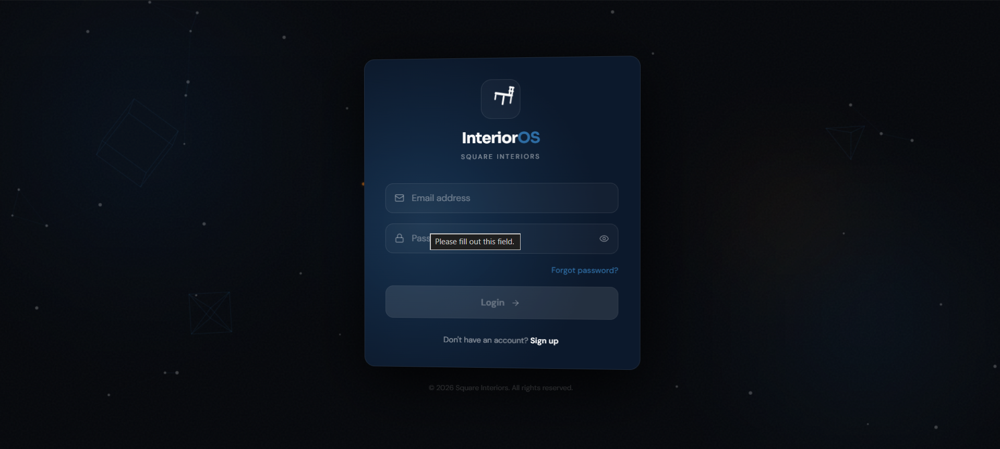
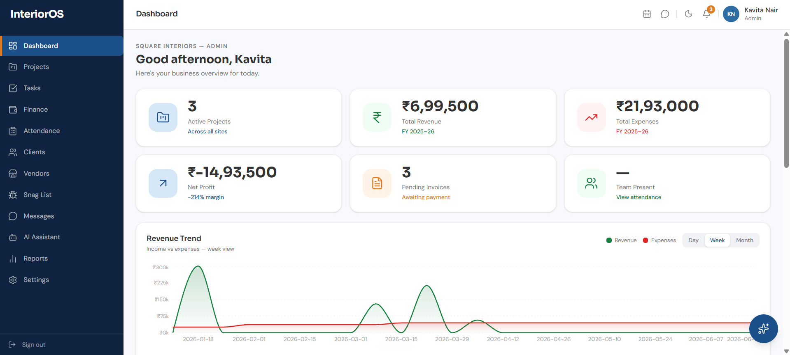
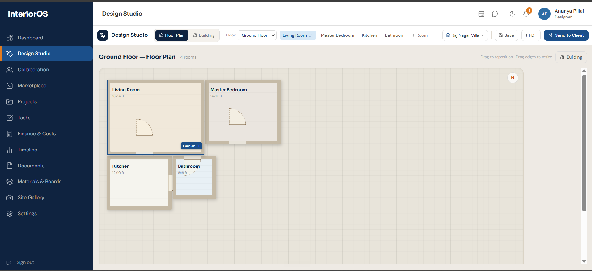
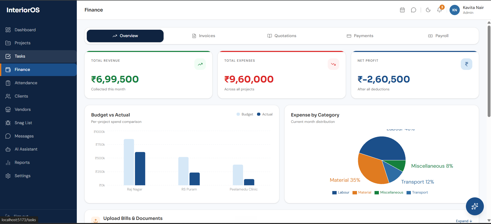

# InteriorOS Frontend

<p align="center">
  
</p>

<h2 align="center">Design. Build. Deliver.</h2>

<p align="center">
A modern React application powering <strong>InteriorOS</strong>, an AI-powered project management platform for interior design firms and construction teams.
</p>

---

## Overview

InteriorOS Frontend is the client application for the InteriorOS platform. Built with **React** and **Vite**, it provides a responsive, role-based interface for managing every stage of an interior design project—from client onboarding and project planning to financial management, design collaboration, and AI-assisted snag detection.

The application replaces spreadsheets, messaging apps, and disconnected tools with a single integrated workspace that keeps teams, clients, and vendors connected throughout the project lifecycle.

---

# Features

## Project Management

* Project Dashboard
* Task Management
* Timeline Tracking
* Attendance Management
* Calendar Scheduling
* Document Management
* Site Gallery

## Design Studio

* Interactive Floor Planning
* Room Layout Management
* Building Organization
* Material Planning
* PDF Export
* Client Sharing

## Financial Management

* Revenue Tracking
* Expense Monitoring
* Budget vs Actual Analysis
* Quotations
* Purchase Orders
* Invoice Management
* Payment Tracking
* Payroll

## AI Assistant

* AI-powered Construction Snag Detection
* Image Upload & Analysis
* Automatic Issue Classification
* AI-generated Descriptions
* Severity Assessment

## Collaboration

* Real-time Messaging
* Client Collaboration
* Vendor Management
* Notifications

## Multi-Role Access

Dedicated dashboards for:

* Administrator
* Designer
* Supervisor
* Client
* Vendor

Each role has a customized interface designed around its workflow and responsibilities.

---

# Application Preview

## Landing Page

<p align="center">

</p>

A modern landing page introducing InteriorOS with a premium SaaS-inspired design, showcasing the platform's vision of simplifying project management for interior design firms.

---

## Secure Login

<p align="center">

</p>

Role-based authentication provides secure access to personalized dashboards for administrators, designers, supervisors, clients, and vendors.

---

## Administrator Dashboard

<p align="center">

</p>

The administrator dashboard provides a real-time overview of business operations, including:

* Active Projects
* Revenue & Expenses
* Attendance Overview
* Pending Invoices
* Revenue Analytics
* Business Performance Metrics

---

## Design Studio

<p align="center">

</p>

The Design Studio allows designers to organize floor plans and collaborate throughout the design process.

Key capabilities include:

* Interactive Floor Planning
* Room Organization
* Building Layout Management
* Material Planning
* Project Organization
* PDF Export
* Client Sharing

---

## Finance Dashboard

<p align="center">

</p>

The Finance module centralizes project finances through an intuitive analytics dashboard.

Features include:

* Revenue Overview
* Expense Tracking
* Budget vs Actual Analysis
* Category-wise Spending
* Payroll Management
* Invoice Tracking
* Quotations
* Payment Management

---

# Tech Stack

### Frontend

* React
* Vite
* Tailwind CSS
* React Router
* Axios
* Socket.IO Client
* Recharts

### Development Tools

* ESLint
* PostCSS
* npm

---

# Project Structure

```text
src/
├── api/
├── assets/
├── components/
├── context/
├── data/
├── hooks/
├── pages/
├── socket/
├── styles/
└── utils/

public/
screenshots/
```

---

# Getting Started

## Clone the Repository

```bash
git clone https://github.com/amruthab47/interioross-frontend.git
```

## Install Dependencies

```bash
npm install
```

## Configure Environment Variables

Create a `.env` file in the project root.

```env
VITE_API_URL=http://localhost:5000
```

Update the API URL if your backend is running on a different host.

---

## Run the Development Server

```bash
npm run dev
```

The application will be available at:

```text
http://localhost:5173
```

---

# Backend

The frontend communicates with a separate Node.js backend.

**Backend Repository**

https://github.com/amruthab47/interioross-backend

Please clone and run the backend before starting the frontend application.

---

# Highlights

* Modern responsive interface
* Interactive Design Studio
* AI-powered snag detection workflow
* Multi-role dashboards
* Financial analytics
* Real-time messaging
* REST API integration
* Responsive layouts
* Clean and scalable React architecture

---

# Future Enhancements

* Mobile application
* Real-time collaborative floor planning
* AI-powered design recommendations
* Offline support
* Progressive Web App (PWA)
* Advanced reporting & analytics

---

# License

This project was developed for educational, portfolio, and demonstration purposes.
